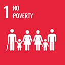
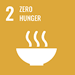
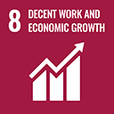
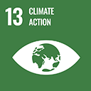
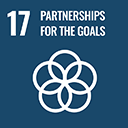

# Laccu Russu - TCR050

* **Status Progetto:** Verificato & Validato
* **Tipologia Progetto:** Sequestro /Rimozione CO2
* **Settore:** Afforestazione & Riforestazione (ARR)&#x20;
* **Metodologia:** Prassi AgriCarbon & ISO 14064-2
* **VVB ( Validation & Verification Body ):**[ Climate Standard](../../vvbs/climate-standard.md)
* **Criteri di Validazione:** ISO 14064-2; UNI CEI EN ISO/IEC 17029:2020; buone pratiche agricolo-forestali; standard LIFE C-Farms; Verra VM0042 v2.0, CDM'’s;  AR-AMS0007 v3.1; Linee guida IPCC (2006); Prassi AgriCarbon & ISO 14064-2; PDD ( Project Design Document )
* **Criteri Verifica:** ISO 14064-2; UNI CEI EN ISO/IEC 17029:2020; buone pratiche agricolo-forestali; standard LIFE C-Farms; Verra VM0042 v2.0, CDM'’s;  AR-AMS0007 v3.1; Linee guida IPCC (2006); Prassi AgriCarbon & ISO 14064-2; Project Annual Report

