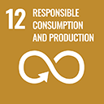

# SDG 12: Consumo e Produzione Responsabili



**Obiettivo 12.6:** Incoraggiare le aziende ad adottare pratiche sostenibili e a integrare le informazioni sulla sostenibilità nel loro ciclo di rendicontazione.


\
**Misurazione dell'impatto:** monitorare il numero di aziende partner che compensano le emissioni attraverso i crediti di carbonio di Carborea e i loro miglioramenti nella rendicontazione della sostenibilità.


