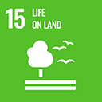

# SDG 15: Vita sulla Terra



**Obiettivo 15.1:** Garantire la conservazione, il ripristino e l'uso sostenibile degli ecosistemi terrestri e di acqua dolce interni.


\
**Misurazione dell'impatto:** Misurare l'aumento della superficie rimboschita, il recupero della biodiversità e il ripristino del suolo utilizzando immagini satellitari e indagini ecologiche.


