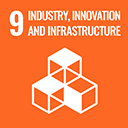

# SDG 9: Industria, Innovazione e Infrastrutture



**Obiettivo 9.5:** Migliorare la ricerca scientifica, aggiornare le capacità tecnologiche e incoraggiare l'innovazione.


\
**Misurazione dell'impatto:** Adottare la tecnologia blockchain per il tracciamento dei crediti di carbonio, utilizzo di immagini satellitari, dispositivi IoT (Internet of Things) ed altri dispositivi di remote sensing, per il monitoraggio dell'atmosfera, degli alberi e del suolo, utilizzo di strumenti di valutazione e criteri di previsione e prevenzione e mitigazione dei rischi basati sull'intelligenza artificiale.


